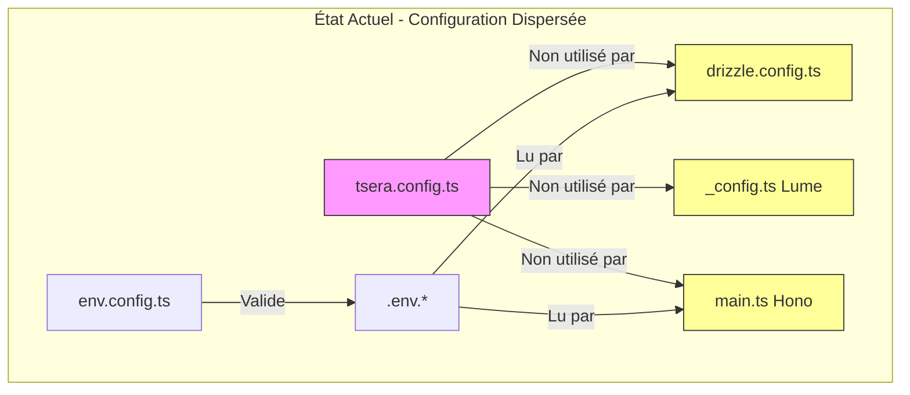
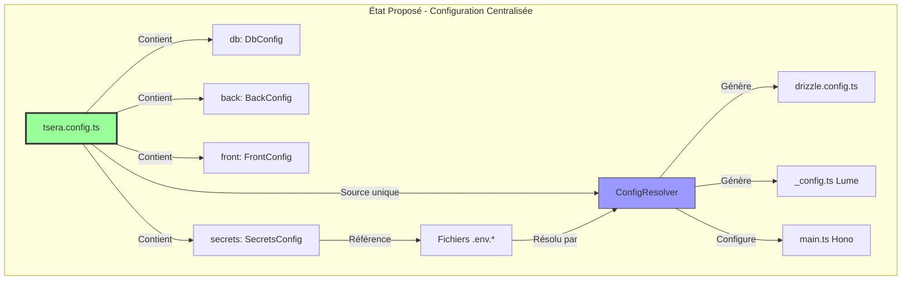
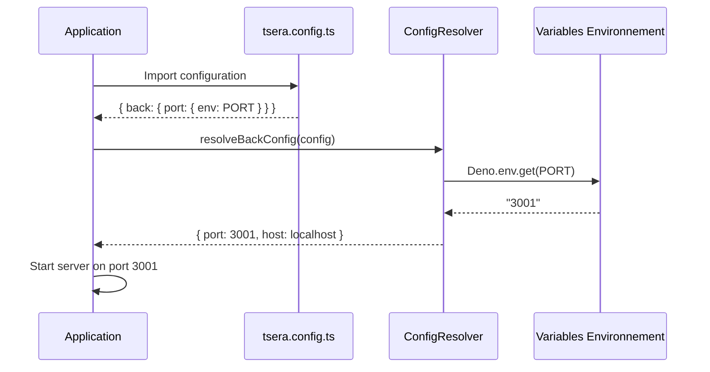

# Plan de Centralisation des Configurations TSera

## 1. Analyse de l'Architecture Actuelle

### 1.1 Fichiers de Configuration Existants

| Fichier                       | Rôle                           | Valeurs                                               | Source de Vérité          |
| ----------------------------- | ------------------------------ | ----------------------------------------------------- | ------------------------- |
| `tsera.config.ts`             | Configuration principale TSera | `openapi`, `docs`, `tests`, `db`, `deploy`, `modules` | Autonome                  |
| `config/db/drizzle.config.ts` | Config Drizzle Kit             | `schema`, `out`, `dialect`                            | Valeurs en dur            |
| `_config.ts` (Lume)           | Config Lume frontend           | `src`, `dest`                                         | Valeurs en dur            |
| `env.config.ts`               | Schéma de validation env       | Types et contraintes                                  | Autonome                  |
| `app/back/main.ts`            | Config serveur Hono            | `port`, `host`                                        | Variables d'environnement |

### 1.2 Problèmes Identifiés



**Problèmes :**

1. **Dispersion** : Configuration éclatée entre 5+ fichiers
2. **Duplication** : Ports et chemins définis à plusieurs endroits
3. **Incohérence potentielle** : `drizzle.config.ts` a `dialect: sqlite` en dur vs `tsera.config.ts`
4. **Templates déconnectés** : Les fichiers de config générés n'utilisent pas `tsera.config.ts`

### 1.3 Types Actuels dans `src/cli/definitions.ts`

```typescript
// Configuration DB actuelle
type DbConfig =
  | { dialect: "postgres"; urlEnv: string; ssl?: "..."; file?: undefined }
  | { dialect: "mysql"; urlEnv: string; ssl?: boolean; file?: undefined }
  | { dialect: "sqlite"; urlEnv?: string; file: string; ssl?: undefined };

// Configuration principale
type TseraConfig = {
  openapi: boolean;
  docs: boolean;
  tests: boolean;
  telemetry: boolean;
  outDir: string;
  paths: PathsConfig;
  db: DbConfig;
  deploy: DeployConfig;
  modules?: ModulesConfig;
  deployTargets?: DeployProvider[];
};
```

---

## 2. Architecture Proposée

### 2.1 Vue d'Ensemble



### 2.2 Nouvelle Structure de `tsera.config.ts`

```typescript
// ============================================================
// NOUVEAUX TYPES - src/cli/definitions.ts
// ============================================================

/**
 * Configuration du backend Hono.
 */
export type BackConfig = {
  /** Port du serveur API (défaut: 3001) */
  port?: number | { env: string }; // Littéral OU référence env
  /** Host du serveur (défaut: "localhost") */
  host?: string | { env: string };
  /** Préfixe des routes API (défaut: "/api/v1") */
  apiPrefix?: string | { env: string };
  /** Activer le mode debug */
  debug?: boolean | { env: string };
};

/**
 * Configuration du frontend Lume.
 */
export type FrontConfig = {
  /** Port du serveur frontend (défaut: 3000) */
  port?: number | { env: string };
  /** Répertoire source (défaut: "./") */
  srcDir?: string;
  /** Répertoire de destination (défaut: "./.tsera/.temp_front") */
  destDir?: string;
  /** Copier les assets automatiquement */
  copyAssets?: string[];
};

/**
 * Référence à une variable d'environnement.
 * Utilisé pour les valeurs sensibles ou environnement-dépendantes.
 */
export type EnvRef = {
  /** Nom de la variable d'environnement */
  env: string;
  /** Valeur par défaut si non définie */
  default?: string | number | boolean;
};

/**
 * Valeur de configuration peut être :
 * - Une valeur littérale (string, number, boolean)
 * - Une référence à une variable d'environnement
 */
export type ConfigValue<T> = T | EnvRef;

/**
 * Configuration des secrets.
 */
export type SecretsConfig = {
  /** Répertoire des fichiers .env (défaut: "config/secrets") */
  dir?: string;
  /** Fichier de schéma (défaut: "env.config.ts") */
  schemaFile?: string;
};

/**
 * Configuration TSera étendue.
 */
export type TseraConfig = {
  // === Artefacts générés ===
  openapi: boolean;
  docs: boolean;
  tests: boolean;
  telemetry: boolean;
  outDir: string;

  // === Paths ===
  paths: PathsConfig;

  // === Base de données ===
  db: DbConfig;

  // === Backend Hono (NOUVEAU) ===
  back?: BackConfig;

  // === Frontend Lume (NOUVEAU) ===
  front?: FrontConfig;

  // === Secrets (NOUVEAU) ===
  secrets?: SecretsConfig;

  // === Déploiement ===
  deploy: DeployConfig;
  deployTargets?: DeployProvider[];

  // === Modules ===
  modules?: ModulesConfig;
};
```

### 2.3 Exemple de `tsera.config.ts` Complet

```typescript
// tsera.config.ts - Source unique de vérité
const config = {
  // === Artefacts générés ===
  openapi: true,
  docs: true,
  tests: true,
  telemetry: false,
  outDir: ".tsera",

  // === Paths ===
  paths: {
    entities: ["core/entities"],
  },

  // === Base de données ===
  db: {
    dialect: "sqlite",
    file: "./app/db/tsera.sqlite",
    // Pour PostgreSQL :
    // dialect: "postgres",
    // urlEnv: "DATABASE_URL",  // Référence env
    // ssl: "prefer",
  },

  // === Backend Hono (NOUVEAU) ===
  back: {
    port: { env: "PORT", default: 3001 },
    host: { env: "HOST", default: "localhost" },
    apiPrefix: "/api/v1",
    debug: { env: "DEBUG", default: false },
  },

  // === Frontend Lume (NOUVEAU) ===
  front: {
    port: { env: "LUME_PORT", default: 3000 },
    srcDir: "./",
    destDir: "./.tsera/.temp_front",
    copyAssets: ["assets"],
  },

  // === Secrets (NOUVEAU) ===
  secrets: {
    dir: "config/secrets",
    schemaFile: "env.config.ts",
  },

  // === Déploiement ===
  deploy: {
    target: "deno_deploy",
    entry: "app/back/main.ts",
    envFile: ".env.deploy",
  },
  deployTargets: [],

  // === Modules ===
  modules: {
    hono: true,
    lume: true,
    docker: true,
    ci: true,
    secrets: true,
  },
};

export default config;
```

---

## 3. Mécanisme de Résolution des Valeurs

### 3.1 Nouveau Module `src/core/config-resolver.ts`

```typescript
/**
 * @module core/config-resolver
 * Résolution centralisée des valeurs de configuration.
 *
 * Supporte deux types de valeurs :
 * 1. Valeurs littérales : port: 3001
 * 2. Références env : port: { env: "PORT", default: 3001 }
 */

import type { ConfigValue, EnvRef } from "../cli/definitions.ts";

/**
 * Vérifie si une valeur est une référence environnement.
 */
export function isEnvRef<T>(value: ConfigValue<T>): value is EnvRef {
  return typeof value === "object" && value !== null && "env" in value;
}

/**
 * Résout une valeur de configuration.
 *
 * @param value - Valeur littérale ou référence env
 * @param envAccessor - Fonction d'accès aux variables d'environnement
 * @returns La valeur résolue
 */
export function resolveValue<T>(
  value: ConfigValue<T>,
  envAccessor: (key: string) => string | undefined = Deno.env.get,
): T | undefined {
  if (isEnvRef(value)) {
    const envValue = envAccessor(value.env);
    if (envValue !== undefined) {
      return parseEnvValue(envValue) as T;
    }
    return value.default as T | undefined;
  }
  return value as T;
}

/**
 * Parse une valeur string en son type approprié.
 */
function parseEnvValue(value: string): string | number | boolean {
  // Boolean
  if (value.toLowerCase() === "true") return true;
  if (value.toLowerCase() === "false") return false;

  // Number
  const num = Number(value);
  if (!isNaN(num) && isFinite(num)) return num;

  // String
  return value;
}

/**
 * Résout toute la configuration backend.
 */
export function resolveBackConfig(
  config: TseraConfig,
  envAccessor?: (key: string) => string | undefined,
): ResolvedBackConfig {
  const back = config.back ?? {};

  return {
    port: resolveValue(back.port, envAccessor) ?? 3001,
    host: resolveValue(back.host, envAccessor) ?? "localhost",
    apiPrefix: resolveValue(back.apiPrefix, envAccessor) ?? "/api/v1",
    debug: resolveValue(back.debug, envAccessor) ?? false,
  };
}

/**
 * Résout toute la configuration frontend.
 */
export function resolveFrontConfig(
  config: TseraConfig,
  envAccessor?: (key: string) => string | undefined,
): ResolvedFrontConfig {
  const front = config.front ?? {};

  return {
    port: resolveValue(front.port, envAccessor) ?? 3000,
    srcDir: front.srcDir ?? "./",
    destDir: front.destDir ?? "./.tsera/.temp_front",
    copyAssets: front.copyAssets ?? ["assets"],
  };
}
```

### 3.2 Types de Configuration Résolue

```typescript
// Configuration résolue avec valeurs concrètes
export type ResolvedBackConfig = {
  port: number;
  host: string;
  apiPrefix: string;
  debug: boolean;
};

export type ResolvedFrontConfig = {
  port: number;
  srcDir: string;
  destDir: string;
  copyAssets: string[];
};

export type ResolvedDbConfig = {
  dialect: "sqlite" | "postgres" | "mysql";
  url: string;
  file?: string;
  ssl?: "disable" | "prefer" | "require" | boolean;
};
```

---

## 4. Templates Mis à Jour

### 4.1 `templates/base/config/db/drizzle.config.ts`

```typescript
/**
 * Drizzle Kit configuration - Généré par TSera
 *
 * Ce fichier importe la configuration depuis tsera.config.ts
 * et génère la configuration Drizzle appropriée.
 *
 * @module config/db/drizzle
 */

import { createDrizzleConfigFromTsera } from "tsera/core/index.ts";
import tseraConfig from "../../tsera.config.ts";

export default createDrizzleConfigFromTsera(tseraConfig);
```

### 4.2 `templates/modules/lume/_config.ts`

```typescript
/**
 * Lume configuration - Généré par TSera
 *
 * Ce fichier importe la configuration depuis tsera.config.ts
 * et génère la configuration Lume appropriée.
 */

import lume from "lume/mod.ts";
import { resolveFrontConfig } from "tsera/core/index.ts";
import tseraConfig from "../tsera.config.ts";

const frontConfig = resolveFrontConfig(tseraConfig);

const site = lume({
  src: frontConfig.srcDir,
  dest: frontConfig.destDir,
  location: new URL(`http://localhost:${frontConfig.port}`),
});

// Copier les assets configurés
for (const asset of frontConfig.copyAssets) {
  site.copy(asset);
}

export default site;
```

### 4.3 `templates/modules/hono/app/back/main.ts` (extrait)

```typescript
import { resolveBackConfig, resolveDbConfig } from "tsera/core/index.ts";
import tseraConfig from "../../tsera.config.ts";

// Résolution centralisée de la configuration
const backConfig = resolveBackConfig(tseraConfig);
const dbConfig = resolveDbConfig(tseraConfig);

// Utilisation des valeurs résolues
const port = backConfig.port;
const host = backConfig.host;
const apiPrefix = backConfig.apiPrefix;

console.log(`🚀 Server starting on http://${host}:${port}`);
```

### 4.4 `templates/modules/secrets/env.config.ts` (mis à jour)

```typescript
/**
 * Schéma des variables d'environnement.
 *
 * Ce fichier définit les variables d'environnement utilisées par
 * l'application. Les valeurs sont définies dans tsera.config.ts
 * et peuvent référencer ces variables via { env: "VAR_NAME" }.
 */

import { defineEnvConfig } from "tsera/core/index.ts";

export default defineEnvConfig({
  // === Base de données ===
  DATABASE_PROVIDER: {
    type: "string",
    required: true,
    description: "Database provider: sqlite, postgresql, mysql",
  },
  DATABASE_URL: {
    type: "url",
    required: true,
    description: "Database connection URL",
  },
  DATABASE_SSL: {
    type: "string",
    required: false,
    description: "SSL mode for database connection",
  },

  // === Backend Hono ===
  PORT: {
    type: "number",
    required: false,
    description: "API server port (default: 3001)",
  },
  HOST: {
    type: "string",
    required: false,
    description: "API server host (default: localhost)",
  },
  DEBUG: {
    type: "boolean",
    required: false,
    description: "Enable debug mode",
  },

  // === Frontend Lume ===
  LUME_PORT: {
    type: "number",
    required: false,
    description: "Lume frontend server port (default: 3000)",
  },

  // === Environnement ===
  DENO_ENV: {
    type: "string",
    required: false,
    description: "Environment: development, staging, production",
  },
});
```

---

## 5. Modifications du CLI

### 5.1 `src/cli/definitions.ts`

**Ajouts nécessaires :**

- Types `BackConfig`, `FrontConfig`, `SecretsConfig`
- Type `EnvRef` pour les références environnement
- Type `ConfigValue<T>` pour les valeurs polymorphes
- Mise à jour de `TseraConfig` avec les nouvelles sections

### 5.2 Nouveau fichier `src/core/config-resolver.ts`

**Responsabilités :**

- Fonction `resolveValue<T>()` pour résoudre valeurs littérales vs env
- Fonction `resolveBackConfig()` pour résoudre la config backend
- Fonction `resolveFrontConfig()` pour résoudre la config frontend
- Fonction `resolveDbConfig()` pour résoudre la config database

### 5.3 `src/core/drizzle-config.ts`

**Modifications :**

- Ajouter `createDrizzleConfigFromTsera(tseraConfig)` qui lit `config.db`
- Garder `createDrizzleConfig()` pour la compatibilité ascendante

### 5.4 `src/core/index.ts`

**Exports à ajouter :**

```typescript
export {
  resolveBackConfig,
  resolveDbConfig,
  resolveFrontConfig,
  resolveValue,
} from "./config-resolver.ts";
export type {
  BackConfig,
  ConfigValue,
  EnvRef,
  FrontConfig,
  SecretsConfig,
} from "../cli/definitions.ts";
```

### 5.5 `src/cli/commands/init/utils/config-generator.ts`

**Modifications :**

- Générer le `tsera.config.ts` avec les nouvelles sections `back`, `front`, `secrets`
- Inclure des exemples commentés pour PostgreSQL/MySQL

### 5.6 Mise à jour du Golden File

**Fichier :** `src/cli/commands/init/__golden__/tsera.config.ts`

Le golden file doit refléter la nouvelle structure complète.

---

## 6. Flux de Résolution



---

## 7. Migration et Rétrocompatibilité

### 7.1 Stratégie de Migration

1. **Phase 1** : Ajouter les nouveaux types sans casser l'existant
2. **Phase 2** : Ajouter les fonctions de résolution
3. **Phase 3** : Mettre à jour les templates
4. **Phase 4** : Mettre à jour le générateur `init`

### 7.2 Rétrocompatibilité

- `back`, `front`, `secrets` sont optionnels dans `TseraConfig`
- Les valeurs par défaut sont appliquées si sections manquantes
- `createDrizzleConfig()` reste disponible pour usage direct

---

## 8. Résumé des Modifications

### Nouveaux Fichiers

| Fichier                       | Description                       |
| ----------------------------- | --------------------------------- |
| `src/core/config-resolver.ts` | Logique de résolution des valeurs |

### Fichiers Modifiés

| Fichier                                            | Modifications                                                      |
| -------------------------------------------------- | ------------------------------------------------------------------ |
| `src/cli/definitions.ts`                           | Ajout types `BackConfig`, `FrontConfig`, `SecretsConfig`, `EnvRef` |
| `src/core/drizzle-config.ts`                       | Ajout `createDrizzleConfigFromTsera()`                             |
| `src/core/index.ts`                                | Nouveaux exports                                                   |
| `templates/base/config/db/drizzle.config.ts`       | Import depuis `tsera.config.ts`                                    |
| `templates/modules/lume/_config.ts`                | Import depuis `tsera.config.ts`                                    |
| `templates/modules/secrets/env.config.ts`          | Documentation mise à jour                                          |
| `src/cli/commands/init/__golden__/tsera.config.ts` | Nouvelle structure                                                 |

---

## 9. Avantages de l'Architecture Proposée

1. **Source Unique de Vérité** : `tsera.config.ts` centralise toutes les configurations
2. **Flexibilité** : Support des valeurs littérales ET des références environnement
3. **Type-Safety** : Tous les types sont définis et validés
4. **Cohérence** : Les templates générés utilisent la même source
5. **Maintenabilité** : Un seul fichier à modifier pour changer la configuration
6. **Sécurité** : Les secrets restent dans les fichiers `.env.*`, référencés par nom

---

## 10. Prochaines Étapes

1. Valider cette architecture avec l'utilisateur
2. Implémenter les nouveaux types dans `definitions.ts`
3. Créer le module `config-resolver.ts`
4. Mettre à jour les templates
5. Mettre à jour le générateur `init`
6. Mettre à jour les tests
